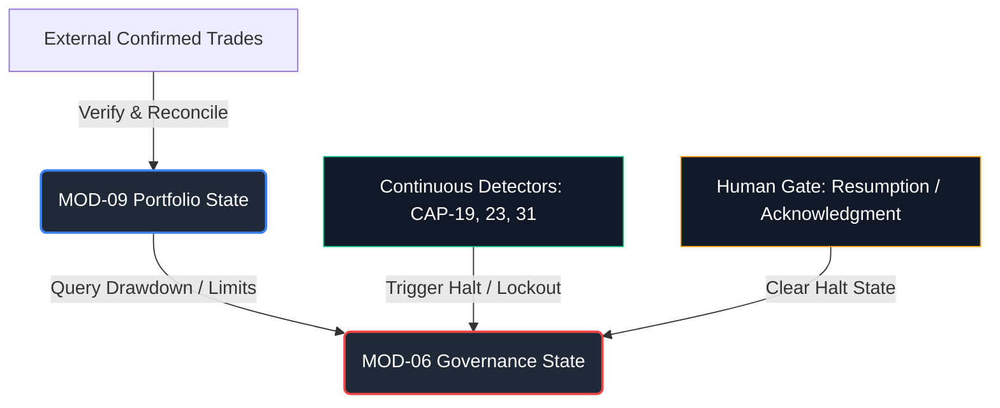

# ADR-005 — STATE AND PERSISTENCE REALIZATION

**Document Type:** Architectural State Realization Specification  
**Method:** 4D_PLUS_METHOD (Deconstruct · Diagnose · Develop · Deliver)  
**Produced By:** State Authority Architect / Information Ownership Analyst / Persistence Realization Authority  

**Authority Hierarchy:**
- Level 1: [SDM_V2.3.md](file:///mnt/data/rj/AI_analyst_Market_research/ADR/Constitution/SDM_V2.3.md) (FROZEN — FINAL CANONICAL)
- Level 2: [VAL05_OWNER_DECISION_RESOLUTION.md](file:///mnt/data/rj/AI_analyst_Market_research/ADR/Constitution/VAL05_OWNER_DECISION_RESOLUTION.md) (RESOLVED)
- Level 3: [SADR_V2.1.md](file:///mnt/data/rj/AI_analyst_Market_research/ADR/Constitution/SADR_V2.1.md) (CERTIFIED)
- Level 4: [ARCHITECTURE_FOUNDATION_V1.md](file:///mnt/data/rj/AI_analyst_Market_research/ADR/Constitution/ARCHITECTURE_FOUNDATION_V1.md)
- Level 5: [ADR-000_ARCHITECTURE_PRINCIPLES.md](file:///mnt/data/rj/AI_analyst_Market_research/ADR/Constitution/ADR-000_ARCHITECTURE_PRINCIPLES.md)
- Level 6: [ADR-001_ARCHITECTURAL_STYLE_SELECTION.md](file:///mnt/data/rj/AI_analyst_Market_research/ADR/Constitution/ADR-001_ARCHITECTURAL_STYLE_SELECTION.md)
- Level 7: [ADR-002_CAPABILITY_TO_MODULE_REALIZATION.md](file:///mnt/data/rj/AI_analyst_Market_research/ADR/Constitution/ADR-002_CAPABILITY_TO_MODULE_REALIZATION.md)
- Level 8: [ADR-003_MODULE_INTERNAL_REALIZATION.md](file:///mnt/data/rj/AI_analyst_Market_research/ADR/Constitution/ADR-003_MODULE_INTERNAL_REALIZATION.md)
- Level 9: [ADR-003A_ARCHITECTURAL_OBSERVATIONS_RESOLUTION.md](file:///mnt/data/rj/AI_analyst_Market_research/ADR/Constitution/ADR-003A_ARCHITECTURAL_OBSERVATIONS_RESOLUTION.md) & [ADR-003B_CONSTITUTIONAL_CLARIFICATION_AMENDMENT.md](file:///mnt/data/rj/AI_analyst_Market_research/ADR/Constitution/ADR-003B_CONSTITUTIONAL_CLARIFICATION_AMENDMENT.md)
- Level 10: [ADR-004_ARCHITECTURAL_BOUNDARY_ENFORCEMENT.md](file:///mnt/data/rj/AI_analyst_Market_research/ADR/Constitution/ADR-004_ARCHITECTURAL_BOUNDARY_ENFORCEMENT.md)

**Evidence Boundary:** `Constitution/` directory only. No conclusion may originate from outside this boundary.  
**Status:** FINAL  
**Scope:** Defines the complete constitutional state and persistence realization. This document does not name databases, clouds, queues, libraries, APIs, services, or programming languages. All state characteristics and durability requirements are derived from constitutional authority, rendering future technology selections downstream mathematical derivations of this specification.

---

## SECTION 01 — STATE REALIZATION METHODOLOGY

### 1.1 Purpose
This document establishes how the system's information assets survive time, crash events, and restarts while preserving absolute constitutional authority. State is defined as any information retained by a module across capability executions. Persistence is defined as the requirement for state to survive system restarts in a non-volatile medium.

By defining the state model, mutability parameters, and reconstruction protocols, this document ensures that future implementation decisions (such as choosing between file-based storage, relational databases, or document stores) are constrained by constitutional truth rather than developer assumption.

### 1.2 Evidence-Bound Classification
All state elements are classified along three dimensions derived from the authority chain:
1. **Lifecycle Duration:** Transient (discarded during execution), Cycle-Persistent (retained for a single recommendation cycle), or Cross-Cycle Persistent (retained across cycles indefinitely).
2. **Mutability:** Immutable (cannot be modified after creation) or Mutable (subject to authorized state transition rules).
3. **Reconstitution Basis:** Primary Source (cannot be derived, must be persisted natively) or Reconstructable (can be mathematically regenerated from upstream primary sources).

---

## SECTION 02 — AUTHORITY-DERIVED STATE CONSTRAINTS

The following binding constraints govern all state and persistence designs within the system:

| Constraint ID | Constraint Description | Authority Source |
|---|---|---|
| **SC-01** | **Single Source of Portfolio State:** Portfolio state must reside in a single module ([MOD-09](file:///mnt/data/rj/AI_analyst_Market_research/ADR/Constitution/ADR-002_CAPABILITY_TO_MODULE_REALIZATION.md#L432)) and update only via human-confirmed external trade records. No other module may maintain shadow portfolio state. | [ADR-000 P-05](file:///mnt/data/rj/AI_analyst_Market_research/ADR/Constitution/ADR-000_ARCHITECTURE_PRINCIPLES.md#L763); [ADR-004 OWN-01](file:///mnt/data/rj/AI_analyst_Market_research/ADR/Constitution/ADR-004_ARCHITECTURAL_BOUNDARY_ENFORCEMENT.md#L157) |
| **SC-02** | **Audit Immutability:** Audit records must be write-once, terminal, and structurally immutable. No runtime read-back to recommendation or governance logic is permitted. | [SADR CHANGE-06](file:///mnt/data/rj/AI_analyst_Market_research/ADR/Constitution/SADR_V2.1.md#L25); [ADR-000 P-07](file:///mnt/data/rj/AI_analyst_Market_research/ADR/Constitution/ADR-000_ARCHITECTURE_PRINCIPLES.md#L765); [ADR-004 DEP-03](file:///mnt/data/rj/AI_analyst_Market_research/ADR/Constitution/ADR-004_ARCHITECTURAL_BOUNDARY_ENFORCEMENT.md#L326) |
| **SC-03** | **Halt State Independence:** The four halt states must represent independent binary state flags with distinct entry and exit authorities. No shared state or combined state machine may couple them. | [SDM-CONST-14](file:///mnt/data/rj/AI_analyst_Market_research/ADR/Constitution/SDM_V2.3.md#L25); [ADR-000 P-06](file:///mnt/data/rj/AI_analyst_Market_research/ADR/Constitution/ADR-000_ARCHITECTURE_PRINCIPLES.md#L764); [ADR-004 GOV-02](file:///mnt/data/rj/AI_analyst_Market_research/ADR/Constitution/ADR-004_ARCHITECTURAL_BOUNDARY_ENFORCEMENT.md#L525) |
| **SC-04** | **Attribution Read-Only:** Attribution records are read-only and possess zero write authority over recommendation or governance logic. System Alpha and Override Delta must remain separate. | [SDM-13 Rules 8, 10](file:///mnt/data/rj/AI_analyst_Market_research/ADR/Constitution/SDM_V2.3.md#L27); [ADR-000 P-08](file:///mnt/data/rj/AI_analyst_Market_research/ADR/Constitution/ADR-000_ARCHITECTURE_PRINCIPLES.md#L766); [ADR-004 DEP-02](file:///mnt/data/rj/AI_analyst_Market_research/ADR/Constitution/ADR-004_ARCHITECTURAL_BOUNDARY_ENFORCEMENT.md#L302) |
| **SC-05** | **Sentiment Advisory Isolation:** News and sentiment signals must exist purely as advisory presentation state, excluded from confidence, EV, ranking, and allocation calculations. | [GOV-VAL05 Rule 1](file:///mnt/data/rj/AI_analyst_Market_research/ADR/Constitution/VAL05_OWNER_DECISION_RESOLUTION.md#L94); [ADR-000 P-09](file:///mnt/data/rj/AI_analyst_Market_research/ADR/Constitution/ADR-000_ARCHITECTURE_PRINCIPLES.md#L767); [ADR-004 OWN-05](file:///mnt/data/rj/AI_analyst_Market_research/ADR/Constitution/ADR-004_ARCHITECTURAL_BOUNDARY_ENFORCEMENT.md#L235) |
| **SC-06** | **No Autonomous Execution State:** The system must not hold or transition to any state that allows autonomous trade order routing or execution. Human approval is an irreplaceable blocking gate. | [SDM-CONST-06](file:///mnt/data/rj/AI_analyst_Market_research/ADR/Constitution/SDM_V2.3.md#L21); [SADR CONSTRAINT-01](file:///mnt/data/rj/AI_analyst_Market_research/ADR/Constitution/SADR_V2.1.md#L632); [ADR-004 HAP-01](file:///mnt/data/rj/AI_analyst_Market_research/ADR/Constitution/ADR-004_ARCHITECTURAL_BOUNDARY_ENFORCEMENT.md#L593) |

---

## SECTION 03 — INFORMATION CLASS STATE MODEL

The 13 information classes defined in [ADR-002 Section 5](file:///mnt/data/rj/AI_analyst_Market_research/ADR/Constitution/ADR-002_CAPABILITY_TO_MODULE_REALIZATION.md#L571) are mapped to their constitutional state representations:

### 3.1 Market Datasets (MOD-01)
- **Represented State:** Inbound raw price buffers, cross-reference mismatch reports, corporate action adjustment vectors, eligibility listings, and delisted-equity historical records.
- **State Nature:** Inbound buffers are transient; finalized split-adjusted and eligible equity sets are cycle-persistent; survivorship-bias-corrected historical tables are cross-cycle persistent.

### 3.2 Market Context State (MOD-02)
- **Represented State:** Active regime classification, stability baselines, drift tracking variables, and the non-ergodic condition signal.
- **State Nature:** Current regime and non-ergodic signals are cycle-persistent; drift metrics and baseline distributions are cross-cycle persistent.

### 3.3 Technical Signals (MOD-03)
- **Represented State:** Primary technical indicator arrays and signal thresholds.
- **State Nature:** Cycle-persistent. Generated and consumed within the active recommendation cycle.

### 3.4 Supplementary Signals (MOD-03)
- **Represented State:** Ingested semantic news vectors, event timelines, and source reliability parameters.
- **State Nature:** Cycle-persistent for advisory packaging; cross-cycle persistent in the audit log.

### 3.5 Conflict Flags and Characterizations (MOD-03)
- **Represented State:** Discrepancy flags (news vs. technical) and textual resolution metadata.
- **State Nature:** Cycle-persistent. Transmitted to confidence scoring as metadata annotations.

### 3.6 Validation Verdicts and Edge Evidence (MOD-04)
- **Represented State:** Walk-forward validation boundaries, out-of-sample edge metrics, t-stat scores, and Deflated Sharpe thresholds.
- **State Nature:** Cycle-persistent. Serves as a blocking gate to confidence scoring.

### 3.7 Recommendations (MOD-05)
- **Represented State:** Confidence scores, expected value assessments, opportunity ranks, allocation percentages, null-state declarations, and exit condition conditions.
- **State Nature:** Cycle-persistent until presented to the human gate, then frozen and pushed to the cross-cycle persistent audit log.

### 3.8 Portfolio State (MOD-09)
- **Represented State:** Position registry, active position count, concentration ratios, illiquidity variables, and current drawdown level relative to the 5% limit.
- **State Nature:** Cross-cycle persistent. Sourced exclusively from external confirmed execution ledgers.

### 3.9 Governance State (MOD-06)
- **Represented State:** Four halt flags (State 1: Governance Halt, State 2: Governance Lockout, State 3: Suspension, State 4: Hard Halt), limit compliance metrics, and active condition records.
- **State Nature:** Cross-cycle persistent. Must survive crash events to prevent startup bypass.

### 3.10 Human Decisions (MOD-07)
- **Represented State:** Explicit approvals, overrides, pricing limit deviations, and secondary authorizations.
- **State Nature:** Cross-cycle persistent. Saved as primary records for audit and attribution.

### 3.11 Attribution Records (MOD-08)
- **Represented State:** System Alpha metrics, Human Override Delta tracking registers, and rejected-opportunity expectancy values.
- **State Nature:** Cross-cycle persistent. Updated asynchronously as market outcomes manifest.

### 3.12 Audit Records (MOD-10)
- **Represented State:** Linear, tamper-evident logs of all system events, decision inputs, and execution results.
- **State Nature:** Cross-cycle persistent. Strictly write-once, read-never at runtime.

### 3.13 Activation Records (MOD-11)
- **Represented State:** Activation mode history (Mode 1, Mode 2, Mode 3), initiating trigger events, and cycle IDs.
- **State Nature:** Cross-cycle persistent. Logged to the audit module upon cycle initiation.

---

## SECTION 04 — STATE MUTABILITY MODEL

State transition authority is strictly bounded. Only the designated owning module may write to or transition its owned state.



### 4.1 Portfolio State Transitions (MOD-09)
- **Rule:** Portfolio state is mutable but write-protected. It cannot transition based on system recommendations or simulation hypotheses.
- **Authorized Path:** State changes occur ONLY when the human confirms a trade externally, and the execution record is received. MOD-09 reconciles this data to update active position counts, drawdown levels, concentration, and illiquidity metrics.

### 4.2 Governance State Transitions (MOD-06)
- **Rule:** The four halt flags are mutable but operate under strict entry/exit transition logic:
  - **State 1 (Governance Halt):** Enters autonomously when MOD-09 drawdown reaches $\ge$ 5%. Exits ONLY on explicit human resumption authorization.
  - **State 2 (Governance Lockout):** Enters autonomously when CAP-31 detects a governance compliance breach. Exits automatically when CAP-31 detects restoration.
  - **State 3 (Conditional Suspension):** Enters autonomously when CAP-23 detects adverse market circuit conditions. Exits automatically when CAP-23 detects condition clearance.
  - **State 4 (Hard Deterministic Halt):** Enters autonomously when CAP-19 detects position/concentration limit breaches. Exits on human acknowledgment AND system-confirmed return within limits.

### 4.3 Immutable State Rules
- **Audit Records (MOD-10):** Strictly immutable. Once written to the audit sink, no system process or human operator can alter, delete, or re-order records.
- **Human Decisions (MOD-07):** Immutable once captured at the gate.
- **Recommendations (MOD-05):** Immutable once synthesized for a cycle.
- **Signals & Validation (MOD-03, MOD-04):** Immutable once computed.

---

## SECTION 05 — PERSISTENT STATE MODEL

Persistent state is the minimum subset of information that must survive system restarts or crashes in a non-volatile medium to maintain system safety, auditability, and compliance.

```
                  ┌──────────────────────────────────────────┐
                  │          NON-VOLATILE PERSISTENCE        │
                  │                                          │
                  │   ┌───────────────┐  ┌───────────────┐   │
                  │   │    MOD-09     │  │    MOD-06     │   │
                  │   │   Portfolio   │  │  Governance   │   │
                  │   │     State     │  │  Halt Flags   │   │
                  │   └───────────────┘  └───────────────┘   │
                  │   ┌───────────────┐  ┌───────────────┐   │
                  │   │    MOD-10     │  │    MOD-07     │   │
                  │   │   Immutable   │  │ Human Actions │   │
                  │   │     Audit     │  │   & Overrides │   │
                  │   └───────────────┘  └───────────────┘   │
                  └───────────────────┬──────────────────────┘
                                      │
                                      ▼
                      [SYSTEM REBOOT / RECOVERY GATE]
                                      │
                                      ▼
                  ┌──────────────────────────────────────────┐
                  │             RECONSTRUCTED STATE          │
                  │                                          │
                  │   ┌───────────────┐  ┌───────────────┐   │
                  │   │    MOD-08     │  │  MOD-01 / 02  │   │
                  │   │  Attribution  │  │  Baselines &  │   │
                  │   │    Metrics    │  │   Regimes     │   │
                  │   └───────────────┘  └───────────────┘   │
                  └──────────────────────────────────────────┘
```

### 5.1 Bounded Durability Requirements
1. **Audit Logs (MOD-10):** Must be preserved indefinitely in write-once, read-many persistent storage.
2. **Authoritative Portfolio State (MOD-09):** Must persist across reboots. If lost, the system cannot evaluate risk limits or drawdowns on startup.
3. **Active Governance Halt Flags (MOD-06):** Active states must persist in non-volatile memory. If the system restarts while a halt or lockout is active, it must boot directly into the same active halt state.
4. **Human Decisions & Overrides (MOD-07):** Must be persisted natively to prevent loss of operator authorization context.
5. **Attribution Records (MOD-08):** Must persist across runs to maintain long-term System Alpha and Override Delta records.

---

## SECTION 06 — TRANSIENT STATE MODEL

Transient state exists only during cycle execution and does not require persistence. It is designed to reside in volatile memory and is discarded upon cycle completion.

### 6.1 Activation Signals (MOD-11)
- **Nature:** The CAP-28 activation initiation signal is a transient event.
- **Routing:** Serves as a start trigger for cycle-dependent modules. It carries no data payload consumed by computational signal logic.

### 6.2 Intermediate Computation State
- **MOD-01:** Raw data buffers, cross-verification tables.
- **MOD-03:** Volatile technical indicator arrays, raw sentiment vectors.
- **MOD-04:** Walk-forward out-of-sample validation scoring registers.
- **MOD-05:** Expected value matrices, temporary ranking lists, conviction allocation computations.
- **Rule:** If the system halts mid-cycle, all intermediate computations are wiped. They are fully reconstructable upon the next activation trigger.

### 6.3 Internal Processing Artifacts
- Conflict evaluation metadata (MOD-03 CAP-09) and temporary threshold bounds (MOD-02 CAP-06) are transient and deleted when the cycle's final recommendations are frozen.

---

## SECTION 07 — PERSISTENCE REQUIREMENTS MATRIX

| Information Class | Owning Module | Persistence Requirement | Mutability | Reconstitution Basis |
|---|---|---|---|---|
| **Market datasets** | MOD-01 | Persistent (Historical baseline) | Immutable | Reconstructable (Re-ingestion & adjustment replay) |
| **Market context state** | MOD-02 | Persistent (Baselines/History) | Immutable | Reconstructable (Re-processing baselines from data) |
| **Signals — technical** | MOD-03 | Transient (Cycle-only) | Immutable | Reconstructable (Regenerate from market data) |
| **Signals — supplementary** | MOD-03 | Persistent (In audit only) | Immutable | Reconstructable (Re-ingestion from source tapes) |
| **Conflict flags** | MOD-03 | Transient (Cycle-only) | Immutable | Reconstructable (Re-evaluation of signals) |
| **Validation verdicts** | MOD-04 | Persistent (In audit only) | Immutable | Reconstructable (Re-running walk-forward validation) |
| **Recommendations** | MOD-05 | Persistent (For human gate & audit) | Immutable | Reconstructable (Re-running synthesis pipeline) |
| **Portfolio State** | MOD-09 | **Persistent** | **Mutable** | **Primary Source / Reconstructable via trade replay** |
| **Governance State** | MOD-06 | **Persistent** | **Mutable** | **Primary Source (Halt status) / Reconstructable (Lockout/Suspension/Halt detection)** |
| **Human decisions** | MOD-07 | **Persistent** | **Immutable** | **Primary Source** (Non-derivable human action) |
| **Attribution Records** | MOD-08 | Persistent | Immutable | Reconstructable (Re-processing decision/outcome delta) |
| **Audit Records** | MOD-10 | **Persistent** | **Immutable** | **Primary Source** (Non-derivable execution history) |
| **Activation records** | MOD-11 | Persistent (In audit only) | Immutable | Reconstructable (Re-logging trigger events) |

---

## SECTION 08 — HISTORICAL RECONSTRUCTION MODEL

Reconstructability allows the system to restore logical state from primary persistent sources, serving as the system's ultimate disaster recovery and audit mechanism.

### 8.1 Audit Reconstruction
The audit log (MOD-10) is reconstructed or validated using cryptographic link validation. Each recorded event block must contain a hash signature of the preceding block, creating a cryptographically verifiable tamper-evident chain back to system genesis.

### 8.2 Portfolio Reconstruction
If portfolio state (MOD-09) becomes corrupted, it must be reconstructed by replaying the chronological sequence of human-confirmed trade actions from the authoritative external execution record. The formula is:
$$S_t = S_0 + \sum_{i=1}^t T_i$$
where $S_t$ is the portfolio state at time $t$, and $T_i$ represents the verified trade adjustments.

### 8.3 Governance Reconstruction
The active flags for State 2 (Lockout), State 3 (Suspension), and State 4 (Hard Halt) can be reconstructed by running their continuous detectors (CAP-31, CAP-23, CAP-19) against the current reconstructed portfolio state and market context.  
State 1 (Governance Halt) cannot be reconstructed purely from data parameters because its exit is governed by human authorization. If State 1 was active at crash time, the system must recover its active flag directly from persistent storage.

### 8.4 Attribution Reconstruction
Attribution records (MOD-08) are reconstructed by re-processing historical recommendations (from the audit log) against recorded human decisions and historical market outcome datasets:
$$\text{Attribution}_t = f(\text{Recommendations}_{[0,t]}, \text{Human Decisions}_{[0,t]}, \text{Market Outcomes}_{[0,t]})$$

---

## SECTION 09 — STATE OWNERSHIP VALIDATION

This section validates that the state model complies with the constitutional requirements of ownership and isolation:

### 9.1 Ownership Preservation
Every state variable is mapped to exactly one producing capability in exactly one module. For example:
- Active position count $\rightarrow$ Owned exclusively by CAP-29 (MOD-09).
- Hard Halt flag $\rightarrow$ Owned exclusively by CAP-24 (MOD-06).
- Audit trail $\rightarrow$ Owned exclusively by CAP-30 (MOD-10).
No write access is granted to other modules. Communication occurs solely via read-only consumption paths.

### 9.2 Authority Preservation
State transitions match the authority class of the owning capability:
- **AUTONOMOUS_RESEARCH:** Transitions occur automatically based on algorithms (e.g. regime classification in CAP-05, drift detection in CAP-06).
- **SHARED_AUTHORITY:** Conflict flags in CAP-09 annotate opportunities but do not modify confidence scores without human review.
- **HUMAN_APPROVAL:** Human decisions captured by CAP-18 at the gate represent non-derivable state transitions that require explicit user interaction.

### 9.3 Anti-Shadow-State Protection
To prevent the recurrence of the validation discrepancies resolved by change control amendments:
- Recommendations (MOD-05) must read live drawdown levels directly from MOD-09. MOD-05 is prohibited from tracking its own drawdown estimation.
- Governance Halt (MOD-06 CAP-25) must evaluate the $\ge$ 5% drawdown threshold directly from the drawdown metric provided by MOD-09. MOD-06 is prohibited from maintaining a separate drawdown calculation state.

---

## SECTION 10 — ARCHITECTURE IMPACT VALIDATION

The state and persistence model is validated against the frozen authority hierarchy:

### 10.1 Validation Against SDM_V2.3
- **SDM-CONST-06 & SDM-CONST-13:** The state model enforces the human approval gate as the sole transition path to trade actions. System recommendations are modeled as transient/read-only advisory states.
- **SDM-CONST-14:** The four halt flags are stored and evaluated as independent state elements in MOD-06, preserving halt independence.
- **SDM-13:** Attribution records (System Alpha and Override Delta) are modeled as distinct, non-merged, read-only persistent layers.

### 10.2 Validation Against VAL05_OWNER_DECISION_RESOLUTION
- **GOV-VAL05 Rule 1:** News and sentiment signals are isolated to the advisory presentation state at the human gate (MOD-07) and are excluded from the computational confidence scoring state in MOD-05.

### 10.3 Validation Against SADR_V2.1
- **CONSTRAINT-01:** No execution state exists.
- **CONSTRAINT-06:** The 5% drawdown gate is modeled as a hard filter within MOD-05, reading directly from the authoritative MOD-09 drawdown state.
- **CHANGE-06:** Audit records are modeled as structurally immutable.

### 10.4 Validation Against ARCHITECTURE_FOUNDATION_V1
- **AF 5.5:** Shadow portfolio states are prohibited. MOD-09 serves as the single source of truth.
- **AF 6.1:** Halt states gate recommendation issuance only. State detectors (CAP-19, CAP-23, CAP-31) run continuously as cycle-independent state monitors.

### 10.5 Validation Against ADR-000 through ADR-004
- **ADR-000 P-05:** Single-source portfolio state enforced.
- **ADR-000 P-07:** Audit terminal sink and immutability enforced.
- **ADR-000 P-08:** Attribution read-only model enforced.
- **ADR-004 OWN-01 & OWN-02:** Module-level write protection of portfolio and governance state enforced.
- **ADR-004 DEP-10:** Activation initiation signals are modeled as transient triggers, preventing their consumption as computational variables.
- **ADR-004 DEP-11:** Independent halt flag states enforced.

---

## SECTION 11 — ARCHITECTURE READINESS VERDICT

### Verdict: ADR-006_MAY_PROCEED

### Constitutional Evidence Chain
The shortest evidence chain supporting this verdict:
1. **SADR Section 11** certifies that VAL-05 is the sole Class A blocker; VAL-05 was resolved by Level 2 authority, certifying all 31 capabilities.
2. **ADR-004 Section 12** issued the verdict `ADR-005 MAY PROCEED` upon verifying the complete boundary enforcement rules.
3. **ADR-005** (this document) establishes the complete constitutional state, mutability, persistence, and reconstruction models, tracing every state element to Levels 1, 3, 4, 7, 8, and 10.
4. All 13 information classes are mapped to single owners, and their persistence requirements are defined in Section 07 without introducing technology assumptions or implementation designs.

Therefore, no state or persistence blockers remain, and the system design may proceed to technology selection and verification specifications in downstream ADRs.

---

*ADR-005 derives its authority exclusively from SDM_V2.3, VAL05_OWNER_DECISION_RESOLUTION, SADR_V2.1, ARCHITECTURE_FOUNDATION_V1, ADR-000, ADR-001, ADR-002, ADR-003, and ADR-004. It introduces no databases, NoSQL systems, file-storage technologies, API routes, or programming constructs. It defines the mathematical and constitutional parameters of system state durability.*

*End of ADR-005_STATE_AND_PERSISTENCE_REALIZATION*
