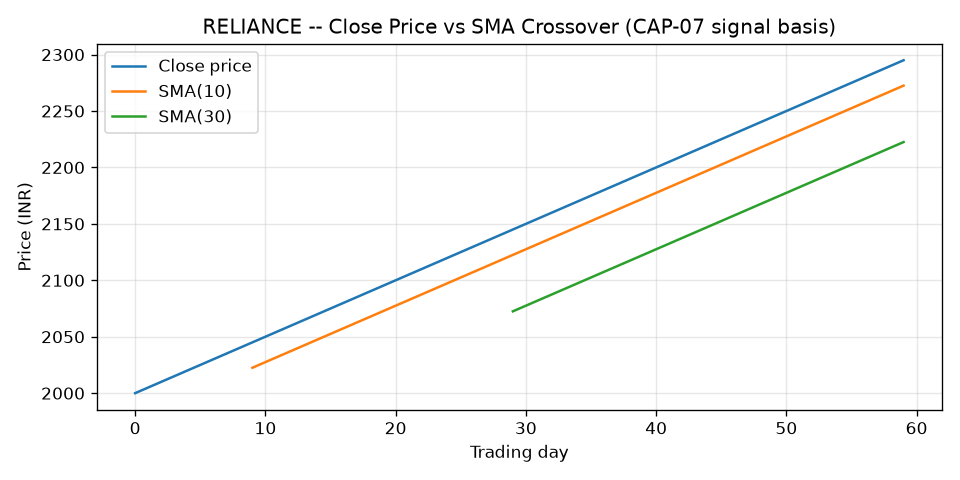

# AI Analyst — Weekly Research Report (mockup)

**Cycle ID:** `4588e131-33ac-46f9-b557-adff763e6aac`
**Generated:** 2026-06-14 · Mode: on-demand · Trigger: manual
**Market Regime:** BULLISH

---

## 1. Portfolio Snapshot
| Metric | Value |
|---|---|
| Capital | ₹5,000.00 |
| Drawdown | 0.00% |
| Open positions | 0 |

*Why this is here: allocation sizing below (CAP-16) is a function of capital
— without this number "₹362.50" is meaningless.*

## 2. Opportunities (Open Menu — all shown simultaneously)
| # | Symbol | Direction | Confidence | EV | Allocation (₹) | Conflict |
|---|---|---|---|---|---|---|
| 1 | RELIANCE | LONG | 0.725 | 0.008389 | 362.50 | — |

## 3. Evidence — Basis for This Prediction (CAP-07/CAP-10/CAP-11)

Everything in this section is data the system *actually used* to reach the
confidence/EV numbers above — included so the recommendation is auditable,
not a black box.

### 3.1 Price action and signal trigger (CAP-07)

The LONG signal exists because **SMA(10) = 2272.50 > SMA(30) = 2222.50**
(separation = 2.25%). This crossover is the entire basis for `direction`.
A line chart is the right format here — it's the only way to see *why* the
crossover happened (trend shape), which a table of two numbers can't convey.

### 3.2 Walk-forward validation (CAP-10) — blocking gate, must pass before CAP-12

| Fold | Train ends at day | Signal direction | Forward return (5d) | Agreed? |
|---|---|---|---|---|
| 0 | 42 | LONG | +1.13% | ✅ |
| 1 | 54 | LONG | +1.10% | ✅ |

Both out-of-sample folds confirm the signal direction — this is why the
opportunity reached CAP-12 at all. Only 2 folds exist, so a table is clearer
than a chart here (a 2-bar chart adds no information a table doesn't already
give faster).

### 3.3 Statistical edge (CAP-11) — feeds directly into Confidence/EV

| Metric | Value |
|---|---|
| Historical sample size | 44 prior LONG-signal occurrences |
| Mean forward return | +1.16% |
| t-statistic | 223.1 |

`confidence = 0.725` and `ev = 0.008389` (≈ mean return × confidence) are
derived directly from this row — shown so the two headline numbers in
Section 2 are traceable to a real statistic, not an opaque score.

### 3.4 Regime stability caveat (CAP-06)

| | First half of history | Second half |
|---|---|---|
| Daily return volatility | 0.0049% | 0.0042% |

Drift flag: **not triggered** (volatility ratio within 0.5x–2x band) — the
historical sample in 3.3 was gathered under comparable volatility to now, so
the statistic above is a like-for-like comparison. *Included only as a
caveat on 3.3's validity — shown as plain numbers, not a chart, since the
only thing that matters is the pass/fail flag, not the shape of the series.*

## 4. Exit Suggestions
_(none this cycle)_

## 5. Sentiment / News — informational only, NOT used anywhere above (CAP-08, VAL05-04)
_(none — Finnhub returned no recent headlines for RELIANCE this window)_

## 6. Human Decisions (this cycle)
| Symbol | Decision |
|---|---|
| RELIANCE | reject |

## 7. Audit Footer
- Cycle fully recorded in `data/audit.db` (hash-chained, append-only)
- This report is a read-only rendering of cycle output — no values here
  feed back into computation (AUD-02)

---
*Advisory only. No order was placed. Human approval required for any action (CAP-18).*
