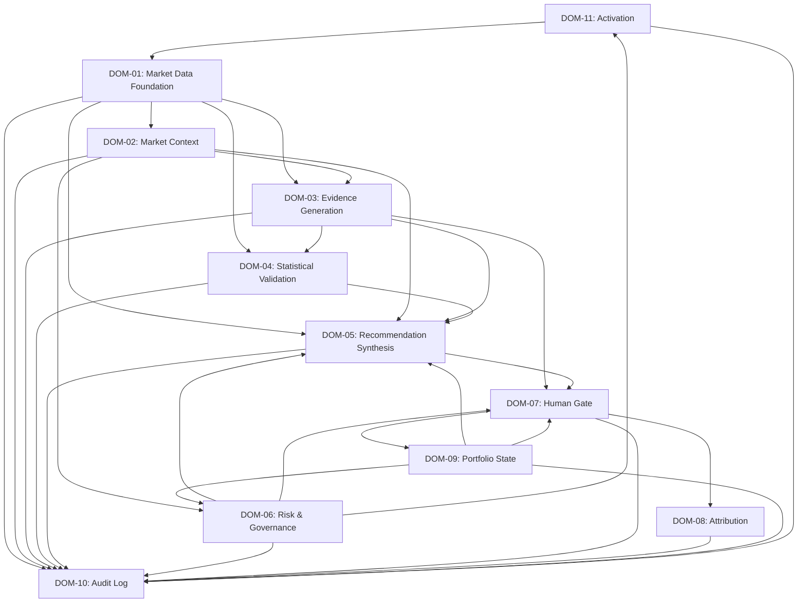

# AI Analyst Market Research (AI Swing Trading Research Analyst)

An AI-powered Swing Trading Research Analyst system for Indian Equities (NSE/BSE). Built using a strict, multi-tier **Constitutional Architecture** that guarantees safety, compliance, and absolute human authority over trade actions.

---

## 📌 Project Overview
The system acts exclusively as an **Advisory Research Analyst**. It processes market data, classifies market regimes, generates signals, performs walk-forward validation, and recommends swing trading opportunities. 

### 🚫 The Ultimate System Boundary
* **No Autonomous Execution:** Under no circumstances does the system initiate, place, modify, or cancel trade orders. All system outputs are strictly advisory.
* **Human-in-the-Loop:** The human owner/operator is the sole execution actor and holds final veto power. 
* **Broker Isolation:** The system has no API credentials or connection pathways to execute trades directly with any broker.

---

## 🏛️ Constitutional Architecture Principles
Every component in this repository adheres to the core rules of **ADR-000 (Architecture Principles)**:

1. **Constitution Before Optimization:** Governance constraints and halt conditions take unconditional precedence over performance, latency, or throughput.
2. **Authority Before Automation:** The system presents structured information for decision-making, not pre-packaged decisions for ratification. 
3. **Sentiment is Advisory Only:** AI/NLP-derived sentiment and news analysis signals are displayed separately and **never** enter computational formulas for confidence, expected value (EV) calculations, ranking, or capital allocation.
4. **Single Owner Per Information Class:** Each information class (e.g., market data, portfolio state, governance state) is owned and generated by exactly one domain.
5. **No Hidden Portfolio State:** Portfolio state is tracked exclusively in the authoritative representation sourced from confirmed human executions.
6. **Governance State Independence:** The four halt states operate as fully independent state machines (simultaneous activation is emergent, not coupled).
7. **Audit is a Terminal Sink:** The system writes to the audit log but cannot read from it to influence runtime execution, preventing automated feedback loops.

---

## 🗂️ Architectural Domains (DAG-based Data Flow)
The system is modularized into **11 non-overlapping domains** that communicate along a directed acyclic graph (DAG):

* **DOM-01: Market Data Foundation:** Ingestion, data cross-verification, universe eligibility enforcement, and survivorship-bias correction.
* **DOM-02: Market Context:** Classification of regimes, concept drift detection, and non-ergodic checks.
* **DOM-03: Evidence Generation:** Technical signal generation (primary layer) and news/sentiment signal intake (supplementary layer).
* **DOM-04: Statistical Validation:** Walk-forward signal validation and statistical edge verification. K-fold validation is constitutionally prohibited.
* **DOM-05: Recommendation Synthesis:** Generation of confidence scores, EV calculations, conviction-weighted allocations, and null-state declarations.
* **DOM-06: Risk & Governance Enforcement:** Handles detection of violations and monitors the four independent halt states.
* **DOM-07: Human Decision Authority:** The final approval gate presenting ranked opportunities as a simultaneous Open Menu.
* **DOM-08: Attribution:** Post-gate tracking separating baseline System Alpha and Human Override Delta (Human Alpha).
* **DOM-09: Portfolio State:** Single source of active position counts and drawdown levels.
* **DOM-10: Audit Log:** Immutable terminal recording sink.
* **DOM-11: Activation:** Controls active/passive cycle run configurations.

---

## 📂 Repository Layout
* **[ADR/](file:///mnt/data/rj/AI_analyst_Market_research/ADR/)**
  * **[Constitution/](file:///mnt/data/rj/AI_analyst_Market_research/ADR/Constitution/)**: Canonical architecture reference documents, principles (ADR-000), styles (ADR-001), boundary enforcement protocols, and freezes.
  * **[ground-work/](file:///mnt/data/rj/AI_analyst_Market_research/ADR/ground-work/)**: Foundation audits, readiness checklists, and risk matrices supporting the architecture's derivation.
